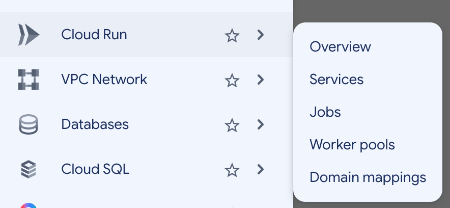
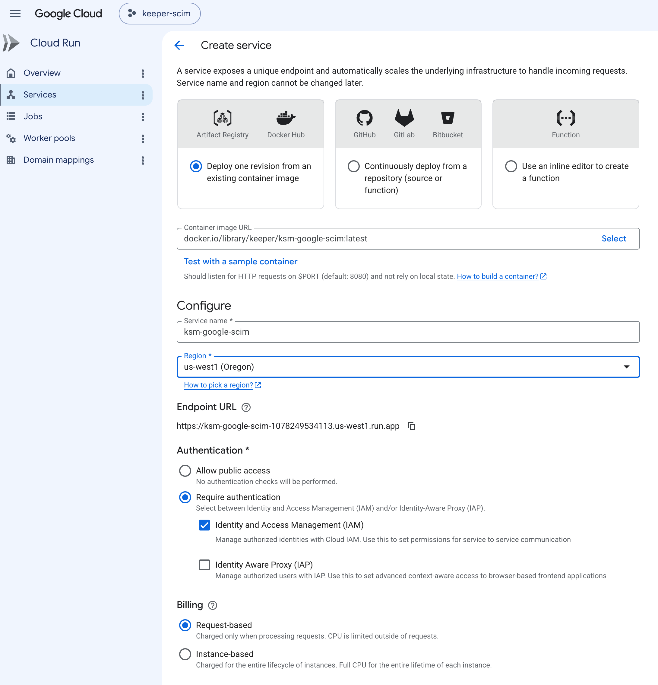
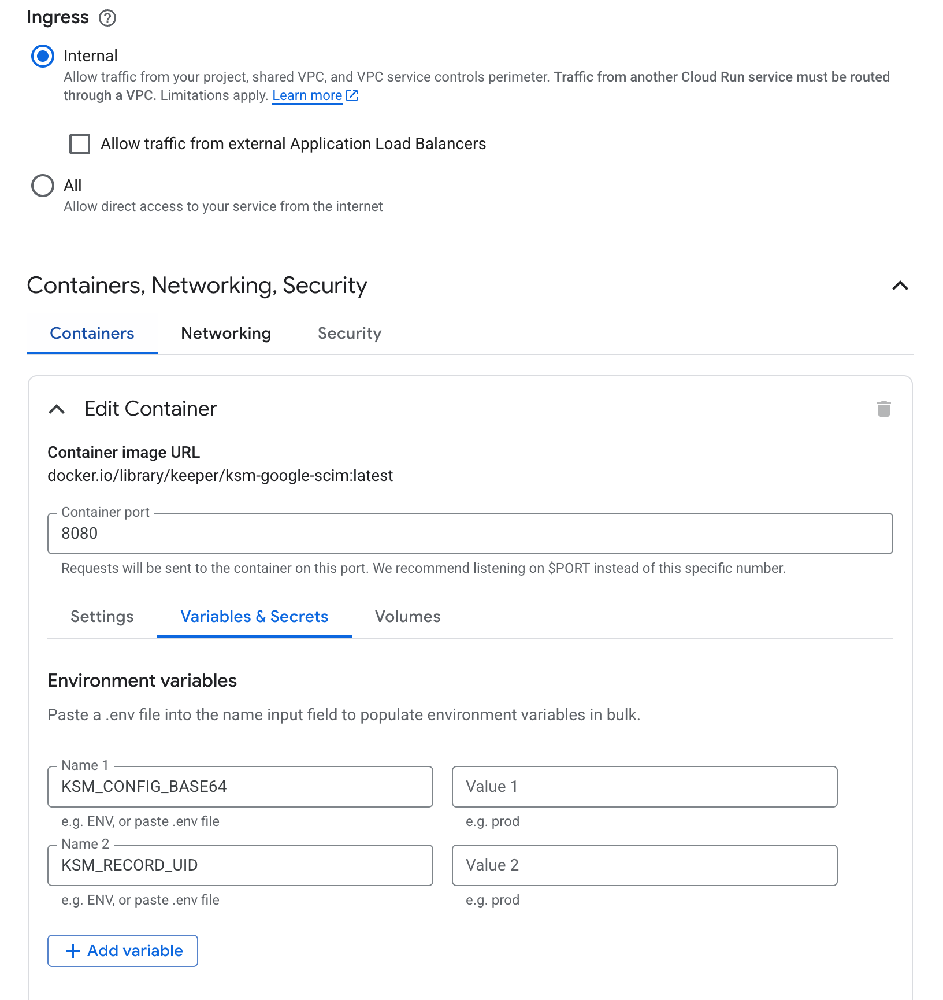
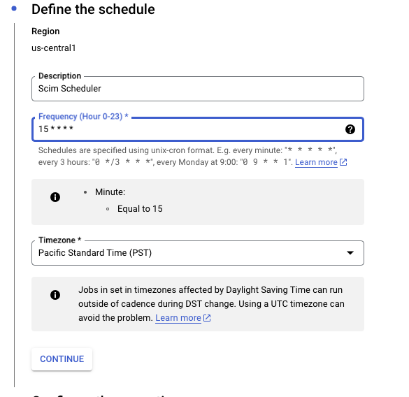
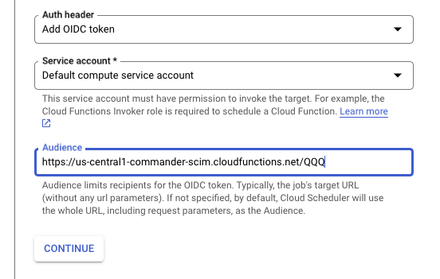
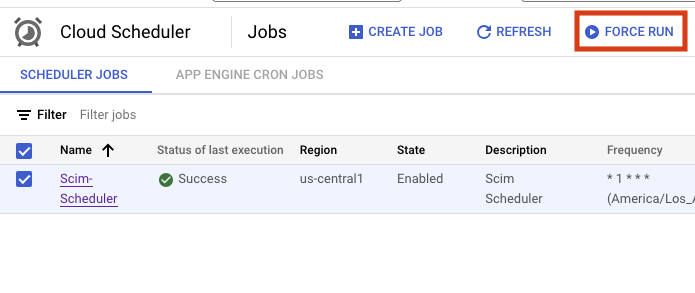

# Keeper Secrets Manager : Google SCIM Push

This repository contains the source code that synchronizes Google Workspace Users/Groups and Keeper Enterprise Users/Teams. This is necessary because Google Workspace does not adequately support Team SCIM provisioning.

## Step by Step Instructions
Read this document: [Google Workspace User and Group Provisioning with Cloud Function](https://docs.keeper.io/en/sso-connect-cloud/identity-provider-setup/g-suite-keeper/google-workspace-user-and-group-provisioning-with-cloud-function)

> This project replicates the `keeper scim push --source=google` [Commander CLI command](https://docs.keeper.io/en/keeperpam/commander-cli/command-reference/enterprise-management-commands/scim-push-configuration) and shares configuration settings with this command.

### Prerequisites
* Keeper Secret Manager enterprise subscription

### Prepare KSM application
  * Create KSM application or reuse the existing one
  * Share the SCIM configuration record with this KSM application
  * `Add Device` and make sure method is `Configuration File` Base64 encoding.

### Local testing

Run the sync locally using a KSM configuration file (`config.base64` in the current directory or `$HOME`):

```shell
go run ./cmd/local [optional-record-uid]
```

### Configuration with `gcloud`

1. Clone this repository locally
2. Copy `.env.yaml.sample` to `.env.yaml`
3. Edit `.env.yaml`
   * Set `KSM_CONFIG_BASE64` to the content of the KSM configuration file generated at the previous step
   * Set `KSM_RECORD_UID` to configuration record UID created for Commander's `scim push` command
4. Deploy to Cloud Run. Replace `<REGION>` placeholder with the GCP region.

```shell
gcloud run deploy ksm-google-scim \
  --source=. \
  --region=<REGION> \
  --memory=512Mi \
  --timeout=120 \
  --max-instances=1 \
  --no-allow-unauthenticated \
  --env-vars-file=.env.yaml
```

Alternatively, deploy the published Docker Hub image:

```shell
gcloud run deploy ksm-google-scim \
  --image=docker.io/keeper/ksm-google-scim:latest \
  --region=<REGION> \
  --memory=512Mi \
  --timeout=120 \
  --max-instances=1 \
  --no-allow-unauthenticated \
  --env-vars-file=.env.yaml
```

Or build locally from the Dockerfile:

```shell
docker build --platform linux/amd64 -t ksm-google-scim .
```

If `go mod download` fails behind Zscaler, uncomment the corporate CA lines at the top of the Dockerfile.

### Docker Hub image

Published automatically on push to `main` or version tags (`v*`):

```shell
docker pull keeper/ksm-google-scim:latest
```

### Create Cloud Run Service with `Google Console`
1.  Navigate to Cloud Run -> Services

   
2. Click `Deploy container` 
* Paste `docker.io/library/keeper/ksm-google-scim:latest` into **Container image URL**
* Pick your `Region`
* Select `Require authentication`
   

* Expand **Containers, Networking, Security**
* Select **Variables & Secrets** tab and add `KSM_CONFIG_BASE64` and `KSM_RECORD_UID` environment variables
   
* Click `Create` button

### Create Cloud Scheduler with `Google Console`

1. Find the deployed Cloud Run service and copy its URL to the clipboard

2. Search for `scheduler` and select `Cloud Scheduler`
3. Click `CREATE JOB`. `15 * * * *` means every hour at 15th minute

   
4. `Configure the execution` Pick **HTTP** `Target type`, **GET** `HTTP method`. Paste the `ksm-google-scim` service URL
5. Grant the scheduler service account the **Cloud Run Invoker** role (`roles/run.invoker`) on the service

   
6. Configure the job to send an OIDC token for authentication
7. Create Scheduler and check it works by clicking `FORCE RUN`

   
