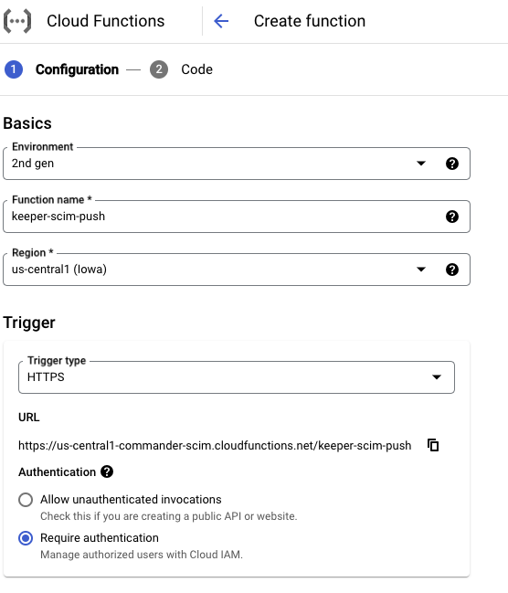
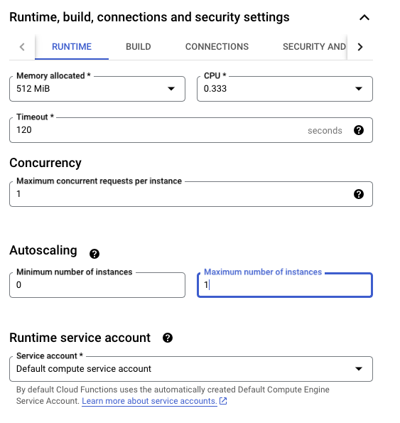
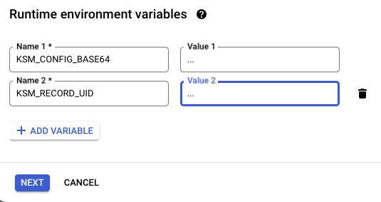
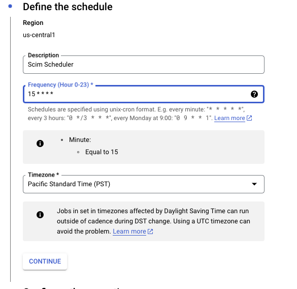
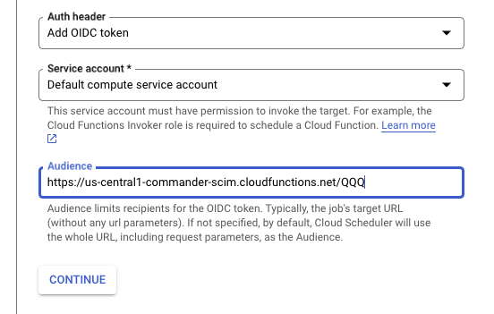
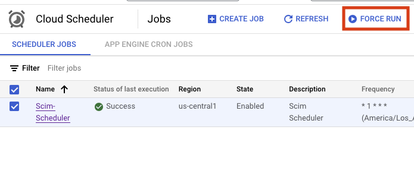

# Keeper Secret Manager Google SCIM Push

This repository contains the source code that synchronizes Google Workspace Users/Groups and Keeper Enterprise Users/Teams.

This code duplicates the `keeper scim push --source=google` Commander's command and shares configuration settings with this command.

To setup SCIM configuration please reference this Commander's page
[Google Workspace Integration](https://docs.keeper.io/secrets-manager/commander-cli/command-reference/enterprise-management-commands/scim-push-configuration#google-workspace)

Once the `scim push` command completes successfully the SCIM sync process can be transfered to the Google Cloud

### Prerequisites
* Keeper Secret Manager enterprise subscription

### Prepare KSM application
  * Create KSM application or reuse the existing one
  * Share the SCIM configuration record with this KSM application
  * `Add Device` and make sure method is `Configuration File` Base64 encoding.

### Configuration with `gcloud`
1. Clone this repository locally
2. Copy `.env.yaml.sample` to `.env.yaml`
3. Edit `.env.yaml`
   * Set `KSM_CONFIG_BASE64` to the content of the KSM configuration file generated at the previous step
   * Set `KSM_RECORD_UID` to configuration record UID created for Commander's `scim push` command
4. Create Google Cloud function. Replace `<REGION>` placeholder with the GCP region. 
```shell
gcloud functions deploy <PickUniqueFunctionName> \
--gen2 \
--runtime=go121 \
--max-instances=1 \
--memory=512M \
--env-vars-file .env.yaml \
--region=<REGION> \
--timeout=120s \
--source=. \
--entry-point=GcpScimSyncHttp \
--trigger-http \
--no-allow-unauthenticated
```

### Configuration with `Google Console`
1. Clone this repository locally
2. Create `source.zip` file that contains "*.go" and "go.*" matches
```shell
zip source.zip `find . -name "*.go"`
zip source.zip `find . -name "go.*"`
```
3. Login to Google Console
4. Create a new function 



   * Set `KSM_CONFIG_BASE64` to the content of the KSM configuration file generated at the previous step
   * Set `KSM_RECORD_UID` to configuration record UID created for Commander's `scim push` command
5. Click `NEXT`
6. Set "Entry point" to `GcpScimSyncHttp`
7. Upload the source code using `source.zip`. "Destination bucket" can be any.

8. Click `DEPLOY`

### Create Cloud Scheduler with `Google Console`
1. Find the created function and copy function URL to the clipboard
   

2. Search for `scheduler` and select `Cloud Scheduler`
3. Click `CREATE JOB`. `15 * * * *` means every hour at 15th minute

   
4. Grant the scheduler access to SCIM function 

   
5. Create Scheduler and check it works by clicking `FORCE RUN`

   
